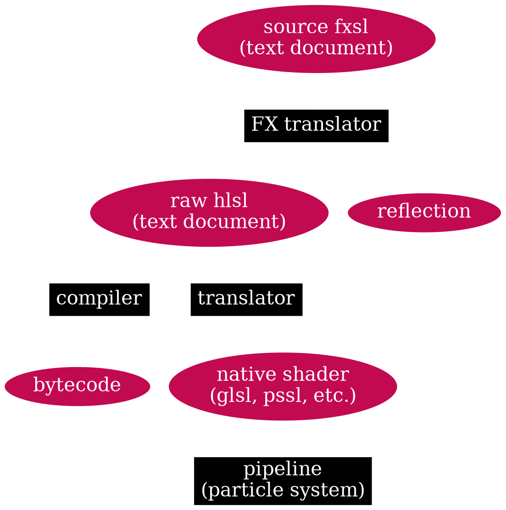
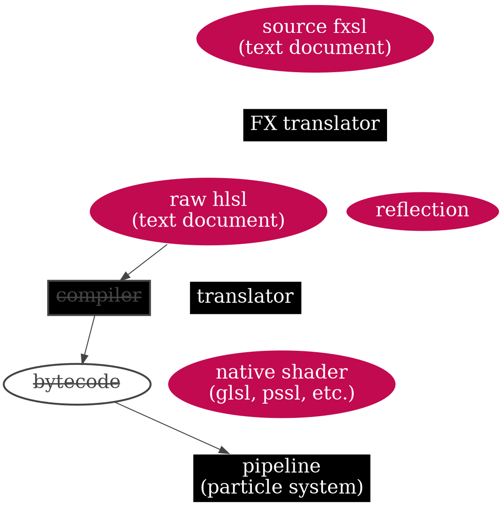

---
presentation:
  theme: "night.css"
  slideNumber: true
  controls: true
  progress: true
  overview: true
  previewLinks: true
  height: 900
---

<!-- slide -->

## Programmable FX Pipeline

<!-- 1. Which systems are formally part of the current FXP? --> 

<!-- slide style="text-align: left" -->

### Flashback #1
Bla Bla from my previous presentation.

<!-- slide -->

### PART I: Programmer approach 
### (No blueprints, just code)

<!-- slide style="text-align: left" -->

#### demo #1
##<a href="./demo-1.mp4" target="_blank">live coding demo</a>

<!-- slide style="text-align: left" -->

#### demo #2
##<a href="./demo-2.mp4" target="_blank">effect examples</a>

<!-- slide -->

## How it works?

<!-- slide style="text-align: left" -->
---
### Framework "Open HLSL"

* Parser (output AST)
* Compiler (output bytecode)
* Virtual Machine
* Translator (HLSL to GLSL)
* FX Translator (Extented HLSL to raw HLSL)
* Language service (LSP, VS code editor)
---
### Sandbox
 * Simple runtime
 * Simple renderer
---

<!-- slide -->

## "Fast&nbsp;forward"

<!-- slide style="text-align: left" -->

### Parser

@import "parser.gif"

<!-- slide style="text-align: left" -->

#### Compiler

@import "bytecode.gif"

<!-- slide style="text-align: left" -->

### Expressions

@import "expressions.gif"

<!-- slide style="text-align: left" -->

### Virtual Machine

 - As simple as possible, __just 200+ lines of code!__
 - Register based, scalar architecture (like GCN)
 - No stack
 ---
 #### Bonus
 + Small bindings for CS shaders execution (__just copy and run!__)

<!-- slide style="text-align: left" -->

### Code emitters & translators

@import "translator.png"

<!-- slide style="text-align: left" -->

### Language service

@import "ls.png"

<!-- slide id="centred" -->

### Programmable pipeline
#### [CPU based particle system]

<!-- slide id="centred" -->

### Programmable pipeline
#### [GPU based particle system]

<!-- slide style="text-align: left" -->

### Runtime
  - FXSL (Extended HLSL) translates to raw HLSL + reflection
    - Raw HLSL is just a CS shaders + VS/PS (__exactly like in Husky now__)
    - Each CS shader is just a bytecode program with according setup (UAVs like particles, states, prerendered particles etc.)
---
#### This is exactly CPU based compute shaders 1:1

<!-- slide -->

## __No difference__ ***where to simulate on the CPU or GPU***

<!-- slide style="text-align: left" -->

### FXSL: Spawn operator

@import "spawnop.png"

<!-- slide style="text-align: left" -->

#### FXSL: Spawn operator

@import "tailfx.gif" {height="800"}

<!-- slide style="text-align: left" -->

### FXSL: Spawn operator

- The op is almost free (no instructions)
- Exactly the same idea as in the [Alienation, 2016] presentation
- Yes, we can finally completly move all kind of trails to GPU! and much much more!

<!-- slide style="text-align: left" -->
### Raw HLSL: Spawn operator

@import "spawnop-raw.png"

<!-- slide style="text-align: left" -->
#### DEMO: single emitter with self spawning
@import "treefx.gif"  {height="800"}

<!-- slide style="text-align: left" -->
#### DEMO: custom shaders + multipass
@import "tablefx.gif"  {height="800"}

<!-- slide style="text-align: left" -->

### Bonus: Autotests
@import "autotests.gif"

<!-- slide style="text-align: left" -->

### Bonus: Preprocessor
@import "preprocessor.png"

<!-- slide -->

## Check the live demo!
### ivanpopov.github.io/influx/

<!-- slide -->

## Ok, What's next?

<!-- slide style="text-align: left" -->

- ### Integration into the engine
- ### Framework improvement
- ### Integration into toolset
- ### Blueprints

<!-- slide style="text-align: left" -->

### Basic pipeline integration into the engine
 - Framework bindings for c++
   - implement VM (~1 day)
   - implement bytecode loaders (~1 day)
   - interaction with compiler/translator (< 1 week)
 - Shader cache integration
   - just call handwritten translator instead of FXC
   - replace cache algo
 - implement same pipeline as in the demo above (< 1 week)
#### bonus: implement GPU based pipeline

<!-- slide style="text-align: left" -->

### Extended pipeline integration into the engine
 - Requires access to "register_common"
   - requires extended macro support
   - requires some improvments of HLSL support
   - requires some binding backend on the c++ side
 - Requires complex integraion to Integration Studio (?)

<!-- slide style="text-align: left" -->
### Framework improvement
 - Full HLSL Support (including preprocessor)
 - Performance
 - Translators improvments
 - FXSL empowerment
 - Langage service improvments
   - VS Code plugin
---
#### Bonus: pipeline feature => batch everything

<!-- slide style="text-align: left" -->

### Integration into toolset
 - Basic integration as "text doc" linked with CLS to IS
 - Extended integration with code highlighting
 - Blueprints
 - ~~Integration with SSL~~

<!-- slide style="text-align: left" -->
### PART II: Art approach 
### (Just blueprints, no code)

<!-- slide style="text-align: left" -->

@import "To-Be-Continued-BTTF.jpg"